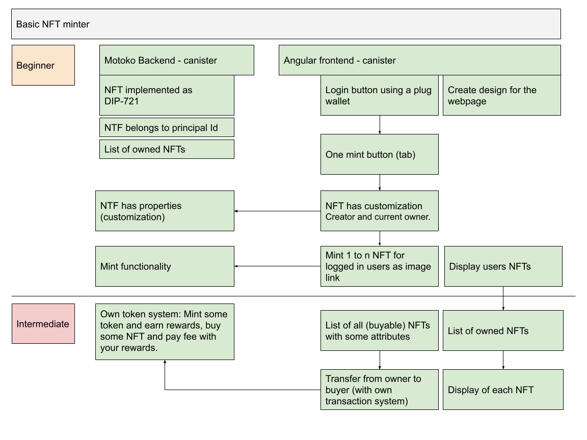

# MotokoBootcampProject - Final Project by rbole

## About the Project



The project let you mint your own NFTs and buy someone else minted NFTs. If you are willing to mint a NFT you will receive token rewards. The following rules are in place:

- For every minted token you will receive 200 tokens.
- When you would like to buy minted NFTs from an other user, you have to own enough tokens. For every purchace you have to pay a fee of 300 from your own tokens.

You can login with a Plug-Wallet or without. In the case you logged in without the Plug-Wallet you can see a list of all minted NFTs. To mint and buy some NFTs you have to use Plug-Wallet to get a valid Principal-Id

If you are logged in you have the following functionality:

- Display your current token balance
- Mint a new NFT by filling in a valid link to an Image-URL (https://picsum.photos/400/400)
- For a valid mint process you will receive your rewards and you will see it in the right corner of the dApp.
- Under the tab "My NFTS" you can see a list of all owned NFTs.
  - There is a list shown with all your NFTs. If you hover over an image you see further attributes:
    - tokenId
    - If it is owned by you, it is represented through the "OWNED" label.
    - The creater is the original minter.
    - current owner of the NFT
- Under the tab "ALL NFTS" you can see your NFTs as well as all other minted NFTS from other users.
  - There is also a list with all minted NFTs. If you hover over the image you see the same attributes like under the "MY NFT" tab. You will also see a label "BUY NFT". If someone connects with a different Plug-Wallet and mint some image, then you will see the iamges here and yoz can buy an image from someone else. However, you have to have enough tokens, at least 300, because that is the fee to buy a NFT.
  - You can force the situation locally with a different dfx identity.
  - You can buy an other NFT by clicking the BUY NFT Button.
  - In the small window - due to the lack of Material Design I have not used a modal dialogue - you can see your current token balance. If you have enouph tokens you can buy an image. In this case the creater remains the same but the principal changes. As a result, your token balance will be reduced as well. You can check it in the right corner.

## Published Version
You can find the public version on the IC-mainnet.

[Demo](https://32d3k-kaaaa-aaaao-aabaq-cai.ic0.app/)


## Open Question

- How to use Angular Material Design with the custom Angular webpack.

## Preparations

Used versions:

 - node.js v14.17.4
 - Angular 12.2.16
 - dfx: 0.8.4

To run he project in your local environment you can use three terminal windows. On a Mac you can use xterm for example.

## Setup

Clone the repo.

```bash
git clone git@github.com:samlinux/MotokoBootCampFinalProject.git
```

Install npm packages.

```bash
cd MotokoBootCampFinalProject
npm install 
```

Start the local replica.

```bash
# termin 1
npm run ng-start-dfx
```

At this point you can do the following:

1. deploy the project locally
2. work with the Angular frontend
3. work with the backend 
4. deploy the project on the IC mainnet

See the script section in the package.json file for useful npm run commands.

### Add 1 - Deploy the project locally

```bash
# in terminal 2
npm run ng-deploy
```
After the start, build and deploy process is finished you can use your Browser and call the local IC server: 

http://localhost:8000/?canisterId=hozae-racaq-aaaaa-aaaaa-c

### Add 2 - Start local Angular development
```bash
# in terminal 2
npm run ng-serve
```

### Add 3 - Start local backend development
Change your Motoko code.

```bash
# in terminal 3

# check for compiler errors
dfx build backend --check

# update the Motoko backend canister
dfx deploy backend --argument '(\"RockStar\",\"RSR\")'

# If you change some public methods, you have to build the candid declarations.
dfx generate

# test your Motoko code
dfx canister call backend greet '("Rockstar")'
```